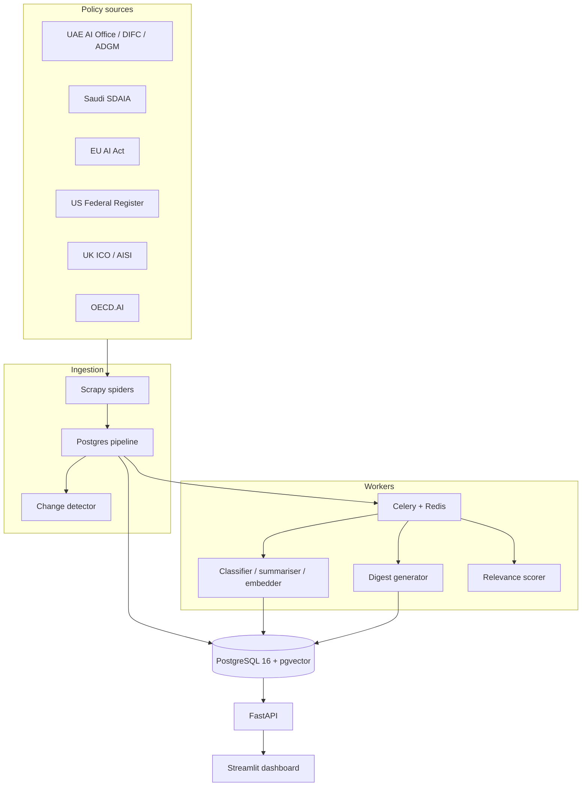

# PolicyPulse AI

**AI policy monitoring for compliance teams in the UAE/GCC and beyond.** Ingests official AI governance documents from UAE, Saudi, EU, US, UK, and OECD sources; tracks changes; classifies risk; enables semantic search and LLM compliance digests; delivers personalised feeds and alerts. Built in Dubai for organisations that must reconcile local AI rules with EU/US extraterritorial exposure.

| | |
|---|---|
| **API** | FastAPI + JWT — http://localhost:8000/docs |
| **Dashboard** | Streamlit — http://localhost:8501 |
| **Live demo** | _Add your Railway/Render URL after deploy_ |
| **Repo** | https://github.com/ru-ri-p/policypulse-ai |

## Who it is for

- **UAE/GCC compliance teams** — track UAE AI Office, DIFC, ADGM, and SDAIA guidance in one feed  
- **Multinationals in Dubai** — reconcile local + EU AI Act extraterritorial obligations  
- **Law firms / consultancies** — white-label MENA AI policy intelligence for clients  
- **AI governance leads** — risk labels, digests, and relevance-scored personalised feeds  

## Architecture



## Quick start

```bash
cd ~/projects/policypulse-ai
python3 -m venv .venv && source .venv/bin/activate
pip install -r requirements.txt
cp .env.example .env   # edit DATABASE_URL, SECRET_KEY, etc.
```

Database (local Postgres):

```bash
psql -U ppuser -d policypulse -f ingestion/schema.sql
python3 -m ingestion.seed_sources
# Run migrations 002–007 as needed (see docs below)
```

Run the stack:

```bash
./scripts/run_api.sh           # :8000
./scripts/run_dashboard.sh     # :8501
./scripts/run_tests.sh         # pytest
```

## Project structure

| Path | Purpose |
|------|---------|
| `ingestion/spiders/` | Scrapy spiders (UAE, SA, EU, US, UK, OECD, NIST, ICO, AISI) |
| `ingestion/pipelines.py` | Postgres upsert + change detection |
| `ml_pipeline/` | Classification, embeddings, search, diff, processor |
| `digests/` | GPT-4o-mini compliance digests |
| `relevance/` | User profile scoring + alerts |
| `api/` | REST API (documents, search, auth, feed, stats) |
| `dashboard/` | Streamlit UI |
| `tests/` | pytest suite (Phase 7) |
| `docker-compose.yml` | API + Postgres + Redis + dashboard |

## Run spiders

```bash
# MENA sources (Phase 8)
./scripts/run_spider.sh uae_ai_office    # UAE Government AI Portal
./scripts/run_spider.sh digital_dubai    # Digital Dubai AI Ethics
./scripts/run_spider.sh adgm_fsra        # ADGM announcements
./scripts/run_spider.sh difc_laws        # DIFC laws & data protection
./scripts/run_spider.sh sdaia_saudi      # Saudi SDAIA / NDMO

# Global sources
./scripts/run_spider.sh federal_register
./scripts/run_spider.sh eu_ai_act
./scripts/run_spider.sh nist_airc
./scripts/run_spider.sh ico_uk
./scripts/run_spider.sh oecd_policy
./scripts/run_spider.sh uk_aisi

python3 -m ingestion.inspect_documents
```

## Tests (Phase 7)

```bash
pip install pytest pytest-asyncio httpx
./scripts/run_tests.sh
```

Covers: text cleaning, diff engine, classifier (mocked), semantic search (mocked), API endpoints (mocked DB).

## MENA daily ingestion (Phase 9)

Law-focused spiders run on **Celery Beat** (06:00–07:50 UTC). Manual:

```bash
./scripts/run_mena_spiders.sh
```

See [docs/phase9_mena_legal.md](docs/phase9_mena_legal.md).

## Phases (course roadmap)

### Phase 1–3 — Ingestion, Celery, API

- Schema, scrapers, change detection, Redis/Celery scheduling  
- Migrations: `002_ml_columns.sql`, `005_api_auth.sql`  
- `./scripts/run_api.sh` → http://localhost:8000/docs  

### Phase 4 — LLM digests

```bash
# OPENAI_API_KEY in .env
psql -U ppuser -d policypulse -f ingestion/migrations/006_digests.sql
python3 -m digests.run_digests --limit 3
```

### Phase 5 — Relevance + alerts

```bash
psql -U ppuser -d policypulse -f ingestion/migrations/007_user_profiles_relevance.sql
```

`POST /user/profile`, `GET /user/feed` (JWT + embeddings on documents).

### Phase 6 — Dashboard + Docker

```bash
./scripts/run_dashboard.sh
docker compose up --build
```

See `docs/phase6_dashboard_deploy.md`.

### Phase 7 — Polish & launch

- Tests: `tests/`  
- Premium sources: `oecd_policy`, `uk_aisi`  
- Portfolio checklist: `docs/phase7_polish_launch.md`  
- Case study outline: `docs/case_study_outline.md`  

### Phase 8 — MENA coverage

```bash
psql -U ppuser -d policypulse -f ingestion/migrations/008_mena_region.sql
python3 -m ingestion.seed_sources
./scripts/run_spider.sh uae_ai_office
./scripts/run_spider.sh adgm_fsra
```

See `docs/phase8_mena_coverage.md`. Dashboard defaults to **Region = MENA**.

**You still do:** 5-min Loom demo, blog post, accelerator applications, screenshots, live URL in README.

## Machine learning (batch, optional)

```bash
python3 -m ml_pipeline.run_classification   # slow on CPU
python3 -m ml_pipeline.embedder --limit 50
python3 -m ml_pipeline.search
```

## Screenshots

Add PNGs under `docs/screenshots/` (dashboard, search, API docs) and link them here after recording your demo.

## License

MIT — see course / your preference.
