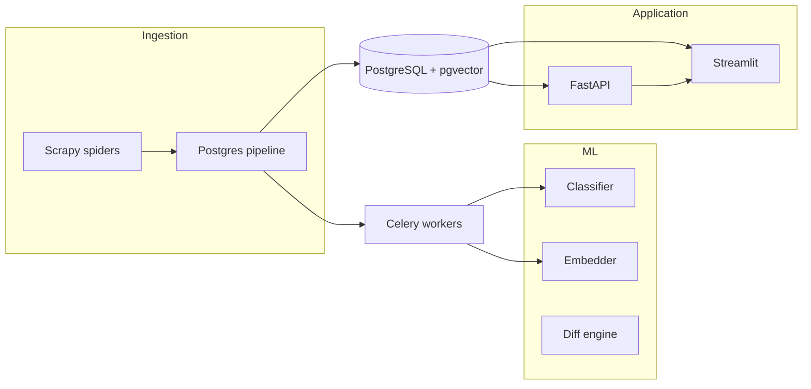

# Case study outline — “How I built an AI policy monitoring system in 6 months”

Target: ~1500 words on Medium or dev.to. Adapt voice to your experience.

## 1. Hook (150 words)

- The problem: AI regulation is fragmented across jurisdictions; manual monitoring does not scale.
- Your goal: a solo-built system that ingests, classifies, searches, and explains policy changes.

## 2. What PolicyPulse does (200 words)

- Audience: compliance officers, policy researchers, AI governance teams.
- Core loop: scrape → store → detect changes → ML classify/summarise/embed → LLM digest → personalised feed/alerts.
- Live stack: PostgreSQL + pgvector, Scrapy, Celery, FastAPI, Streamlit, Docker.

## 3. Architecture (400 words)

Include a simple diagram (Mermaid or screenshot):

Mention: change detection archives `document_versions`; semantic search uses `all-MiniLM-L6-v2`; digests use GPT-4o-mini when key is set.

## 4. Technical challenges (400 words)

Pick 3–4 real stories from your build:

- **Scrapy + Federal Register JSON API** — `parse()` vs `start_requests`, response parsing.
- **pgvector + embeddings** — batch jobs vs real-time Celery; only embedded docs are searchable.
- **Zero-shot classification** — BART-MNLI on CPU is slow; disabled `MLPipeline` in scraper for throughput.
- **OECD SPA** — listing pages embed slugs in HTML; detail pages use meta + govspeak-style extraction.
- **Auth** — JWT, bcrypt on Python 3.13, personalised relevance scoring.

## 5. What you learned (200 words)

- End-to-end ownership: data quality matters more than model choice early on.
- Ship a thin vertical slice (scrape → API → dashboard) before batch ML.
- Tests (`pytest`) and Docker make the project credible for recruiters.

## 6. What's next (150 words)

- Deploy URL, email alerts (SMTP), more sources, fine-tuned classifier, team dashboards.

## 7. CTA

- GitHub repo link
- Demo video (Loom)
- Contact / LinkedIn
